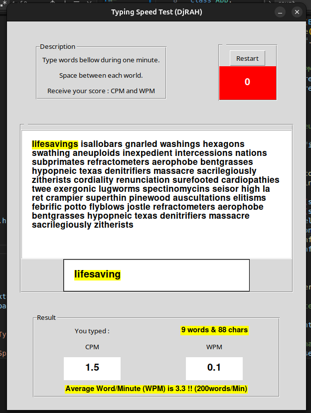

# TypingSpeedTest
GUI to test your typing speed on keyboard. Words used are long and difficult to type. A high score will challenge you.
## prerequisites
Python 3.
## Libraries 
- This App use from tkinter (Tk, ttk, messagebox). Requests, time and sys.
- It manipulate a tkinter's Text, Label, Form, LabelForm,List, event and OOP.
- It verify and valid a text entered by the user.
## How it's implemented
- import data (list of words) from https://random-word-api.herokuapp.com/home, random word API.
- When the user type the first character, a countdown starts fot one minute;
- At the end of the countdown, the number of word typed is given to the user.
## Running
- cd to the directory, run : python3 main.py
## Screenshot
